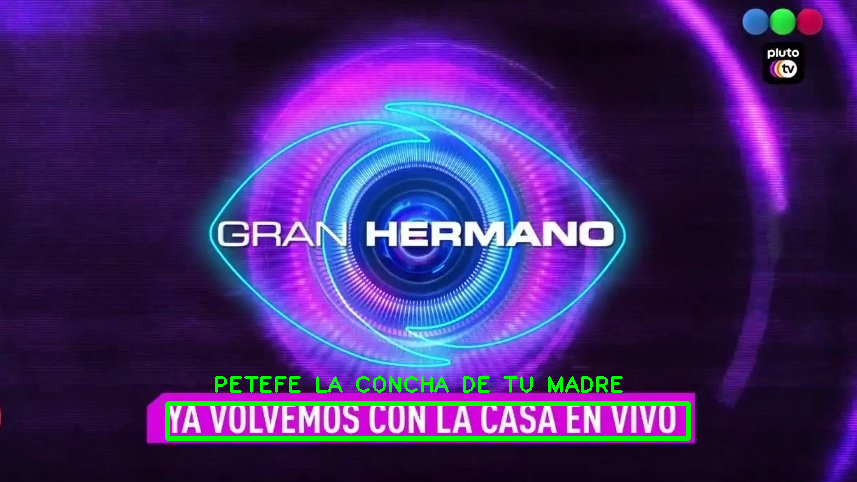

Un detector q había hecho en épocas de gh para ver cuando se corta la transmisión o iniciaban/terminaban publicidades del ex-famosísimo reality de televisión argentina "Gran Hermano".




## Utilización

### <span id="transform">Transform</span>
Para buscar textos, remarcarlos, cropearlos y guardarlos en la carpeta [/results](./results).
```batch
> python3 main.py -t
```

### Test
Para testear imágenes con los textos extraídos (cropeados) con el comando [`-t`](#transform).

```batch
> python3 main.py -d /input-imgs/IMG_DETECTION_02.png
```


## Notas

-   A veces detecta falsos positivos
-   Omití código que se encargaba de leer el stream (la transmisión de GH de PlutoTV sin publicidad) y que, cada 20 frames, verificaba si aparecía alguno de los textos q siempre ponen cuando se corta/reanuda la transmisión ("YA VOLVEMOS", "VOLVIMOS" o "YA VOLVEMOS CON LA CASA EN VIVO"). La razón? estaba incompleto + lo copié de stackoverflow y 50/50 lo entendía kjjj
-   Duración de las animaciones de inicio/finalización de publicidad: 5.7s (apróx.)
-   abz
